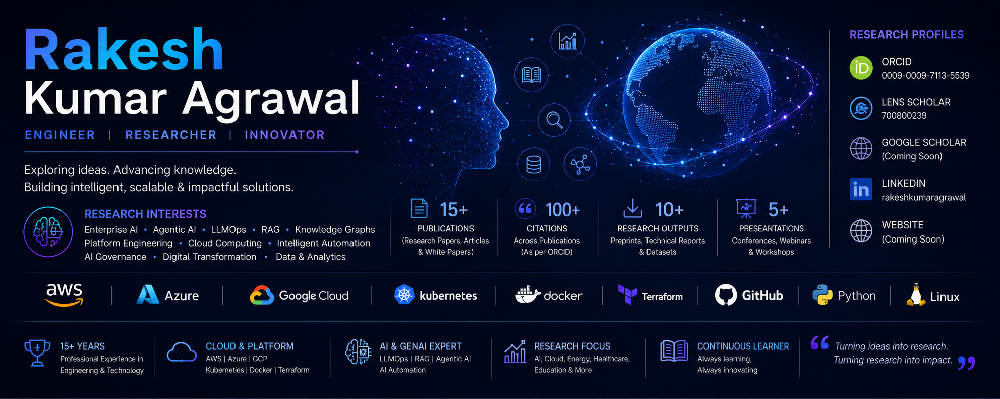
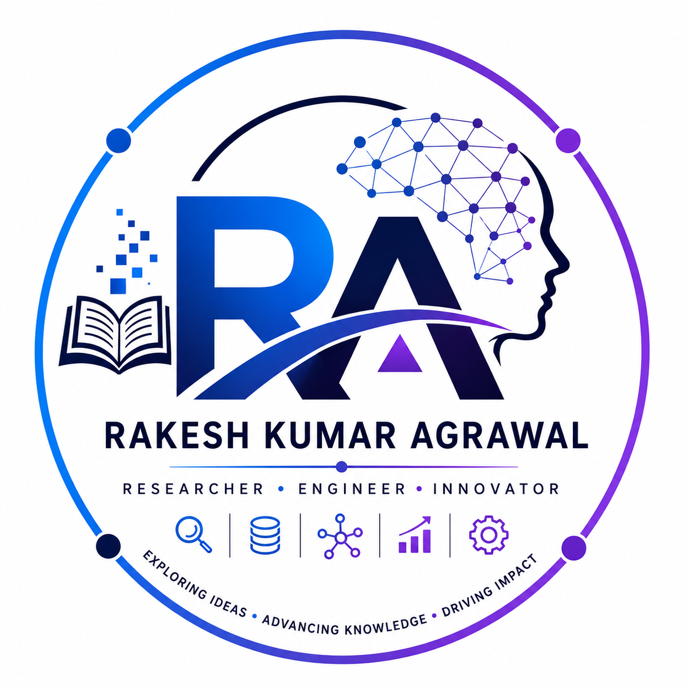

  

  

<h1 align="center">
## 📂 Research Portfolio

| Category | Description |
|----------|-------------|
| 📖 Publications | Journal papers, conference papers, and technical articles |
| 📄 White Papers | Enterprise AI, Platform Engineering, Cloud Architecture |
| 📊 Datasets | Research datasets and benchmarks |
| 🎤 Presentations | Conference talks and technical sessions |
| 🧪 Research Projects | Active and completed research initiatives |
| 📚 Reading Lists | Curated references and learning resources |
</h1>

<b>Rakesh Kumar Agrawal</b> 
Engineer • Researcher • Innovator

Exploring Ideas • Advancing Knowledge • Driving Impact

---

> [!NOTE]
>
> **Research Portfolio**
>
> This repository serves as the central hub for my research activities, publications, datasets, technical reports, presentations, and open-source research in Artificial Intelligence, Enterprise Computing, Cloud Technologies, and Platform Engineering.

---

# 📑 Table of Contents

- [Introduction](#-introduction)
- [Research Areas](#-research-areas)
- [Research Profiles](#-research-profiles)
- [Featured Publications](#-featured-publications)
- [Datasets](#-datasets)
- [White Papers](#-white-papers)
- [Presentations](#-presentations)
- [Open Source Research](#-open-source-research)
- [Research Roadmap](#-research-roadmap)
- [Citation](#-citation)
- [Contact](#-contact)

---

# 🚀 Introduction

Welcome to my Research Portfolio.

This repository brings together my academic and technical research, including publications, preprints, datasets, technical reports, presentations, and open-source projects.

My work focuses on bridging research and real-world engineering by developing scalable, practical, and responsible AI solutions for enterprise environments.

---

# 🔬 Research Areas

## Artificial Intelligence

- Enterprise AI
- Generative AI
- Agentic AI
- Multi-Agent Systems
- AI Governance

## Enterprise Systems

- Enterprise Architecture
- Enterprise Digital Brain
- Intelligent Automation
- Knowledge Management

## Cloud & Platform Engineering

- Cloud Computing
- Platform Engineering
- DevOps
- Kubernetes
- Infrastructure Automation

## Data & Analytics

- Knowledge Graphs
- Retrieval-Augmented Generation (RAG)
- LLMOps
- Data Engineering
- Decision Intelligence

---

# 🌐 Research Profiles

| Platform | Link |
|----------|------|
| ORCID | https://orcid.org/0009-0009-7113-5539 |
| Lens Scholar | https://www.lens.org/lens/profile/700800239/scholar |
| GitHub | https://github.com/RakeshKumarAgrawal |
| LinkedIn | https://www.linkedin.com/in/rakeshkumaragrawal/ |

---

# 📖 Featured Publications

| Publication | Area | Status |
|-------------|------|--------|
| Enterprise Digital Brain | Enterprise AI | 🚧 Ongoing |
| Enterprise AI Operating Models | Enterprise Architecture | 🚧 Ongoing |
| Constitutional Agentic AI | AI Governance | 🚧 Ongoing |
| AI-Augmented Platform Engineering | Platform Engineering | 🚧 Ongoing |
| Enterprise Knowledge Systems | Intelligent Systems | 🚧 Ongoing |

---

# 📊 Datasets

| Dataset | Description | Status |
|---------|-------------|--------|
| Enterprise AI Benchmark | Enterprise AI evaluation dataset | 🚧 |
| Knowledge Graph Dataset | Enterprise knowledge representation | 🚧 |
| RAG Evaluation Dataset | Retrieval benchmarking | 🚧 |
| Platform Engineering Dataset | Cloud & DevOps metrics | 🚧 |

---

# 📄 White Papers

Current research initiatives include:

- Enterprise Digital Brain
- Enterprise AI Blueprint Framework
- Enterprise AI Operating Models
- Agentic AI for Enterprise Systems
- Platform Engineering for AI
- AI Governance Frameworks

---

# 🎤 Presentations

Topics include:

- Enterprise AI
- Generative AI
- Agentic AI
- Enterprise Architecture
- Cloud Computing
- Platform Engineering
- DevOps
- Intelligent Automation

Conference presentations, webinars, workshops, and technical talks will be added here.

---

# 💻 Open Source Research

This research portfolio is complemented by several open-source initiatives.

| Repository | Focus |
|------------|-------|
| Enterprise Digital Brain | AI-powered enterprise knowledge platform |
| Enterprise AI Blueprints | Enterprise AI reference architectures |
| Platform Engineering Toolkit | Cloud-native engineering practices |
| Research Portfolio | Publications, datasets, and technical research |

---

# 🗺 Research Roadmap

## 2026

- [ ] Publish Enterprise Digital Brain white paper
- [ ] Release Enterprise AI Benchmark Dataset
- [ ] Publish Enterprise AI Blueprint Framework
- [ ] Release Knowledge Graph reference implementation

## 2027

- [ ] Publish Agentic AI research
- [ ] Release Enterprise AI evaluation framework
- [ ] Expand research datasets
- [ ] Publish additional open-source reference architectures

---

# 📚 Citation

If you use any material from this repository, please cite it appropriately.

A `CITATION.cff` file will be maintained to support GitHub's built-in citation feature.

---

# 📬 Contact

**Rakesh Kumar Agrawal**

- ORCID: https://orcid.org/0009-0009-7113-5539
- Lens Scholar: https://www.lens.org/lens/profile/700800239/scholar
- GitHub: https://github.com/RakeshKumarAgrawal
- LinkedIn: https://www.linkedin.com/in/rakeshkumaragrawal/

---

### ⭐ Exploring Ideas • Advancing Knowledge • Driving Impact

Thank you for visiting my Research Portfolio.

